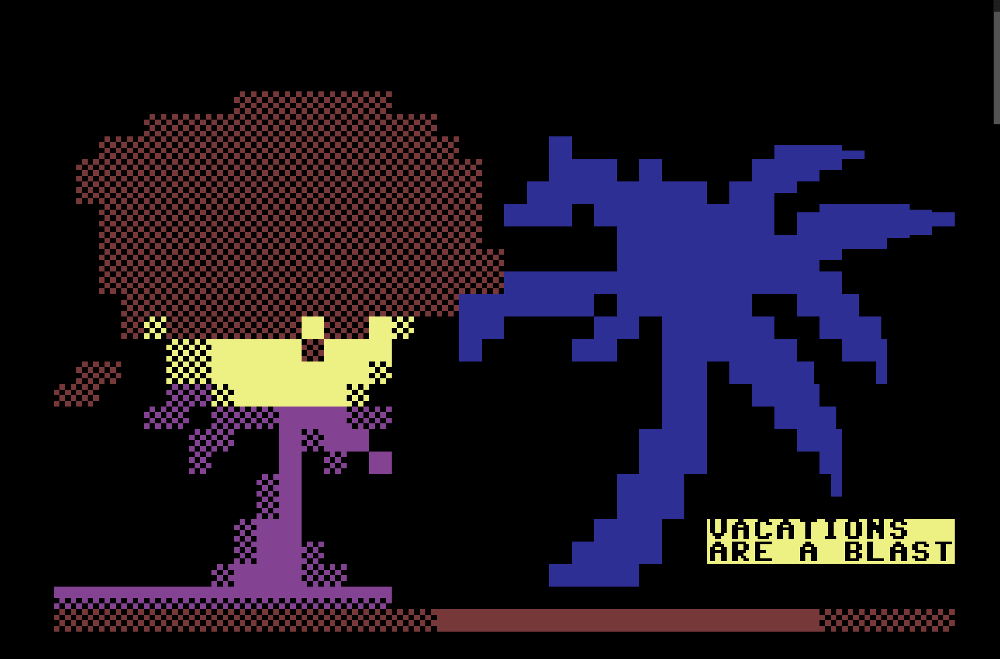
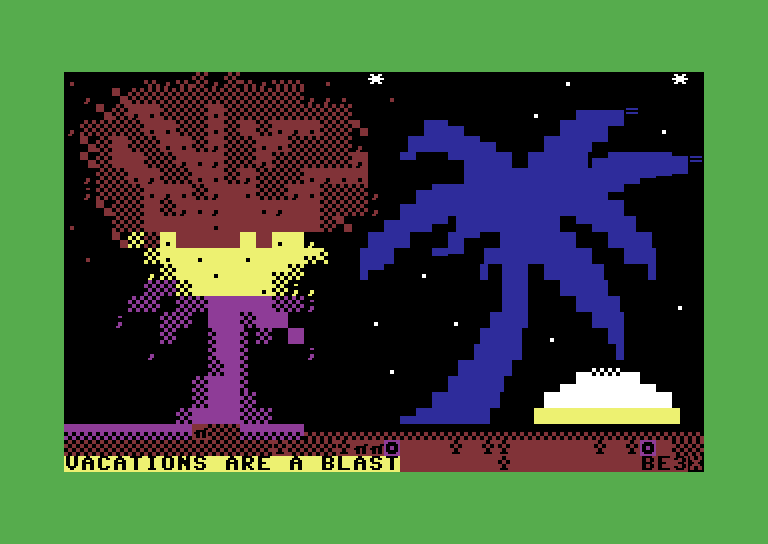
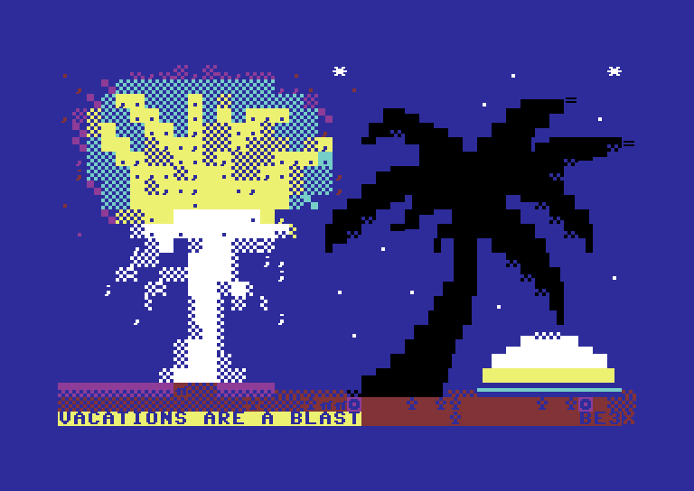
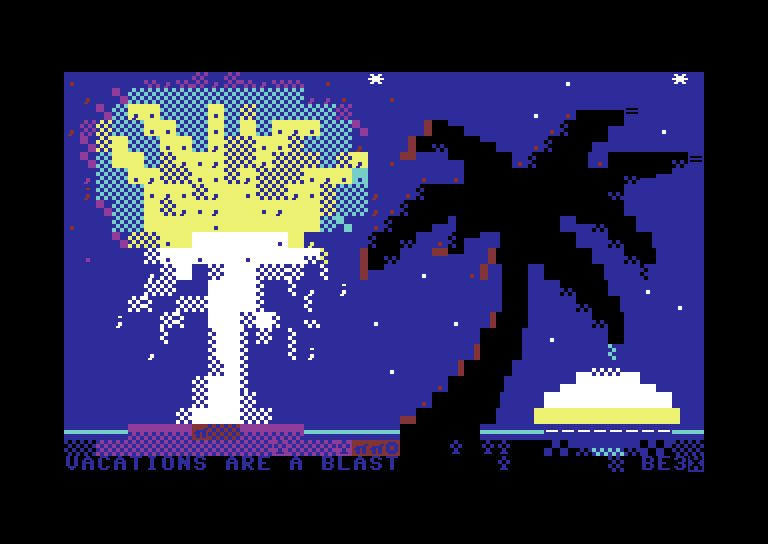
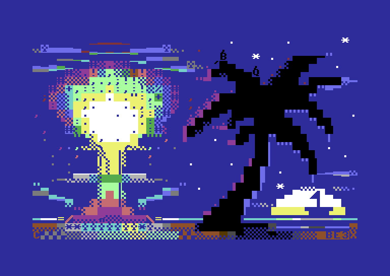
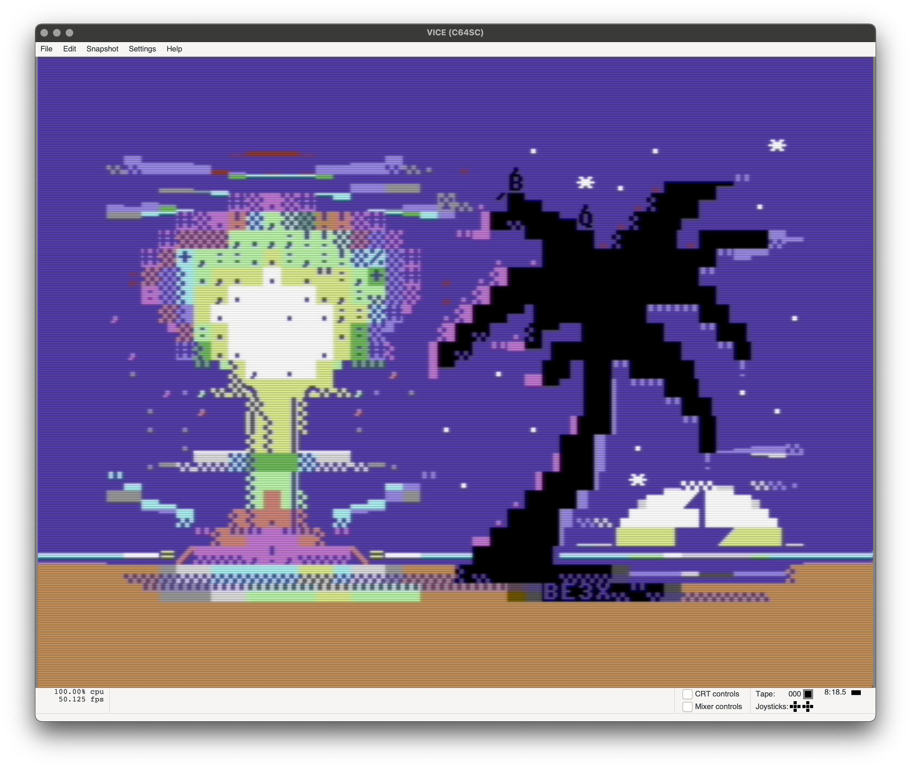

# PETSCII for Inércia 2023

I never demonstrated any actual artistic skills and each time I colored something it looked like puke of a clown. 

However on our Moonshine Discord, hepterida asked who would love to participate on a new presentation format for petscii on the Inercia (showcase instead of competition to attract new folks) and challenged us.

The first of my tries were a disaster and the second one looked clumsy like drawn by a 8 year old, but hepterida saw potential (ok, he just wanted to be nice, this version was pure embarrassment).

From here I added the moon to give the picture a meaning.

Some color changes helped to get the picture into a better state and the original version could be used for refining because the sizes of the objects were already ok.

Now the person who challenged me to participate had to commit to help and gave some good advice what to focus on (better shapes, reflections, ...)

Then came the ideas of adding a ship, birds, more clouds and better colors, making the blast more refined and it started to become something that I wouldn't be ashamed of publishing ;)

Finally, Fieser Wolf of Abyss Connection recommended to use the border to make the picture more interesting. So I've added two raster interrupts to extend the lines of the horizon and colored the bottom in the color of the beach. This is not strictly PETSCII any more, but this showcase allows more creative use of technology. Notice the different colors with pepto color emulation.

Used sources/tools/resources:
- [Online Petscii editor](http://petscii.krissz.hu/)
- [Inspiration by Frida Katarine (sun and clouds)](https://csdb.dk/release/?id=201668)
- [Inspiration by Anime Flora (palm tree)](https://www.deviantart.com/anime-flora/art/Dream-Palm-Trees-25833440)
- [Inspiration by Dwarf (blast)](https://tomseditor.com/gallery/i/13316/atom-by-dwarf)
- [Unlimited patience and support by hepterida](https://demozoo.org/sceners/136667/)
- [Great suggestions by Fieser Wolf of Abyss Connection](https://englishclass.de/~wolf/ac/)